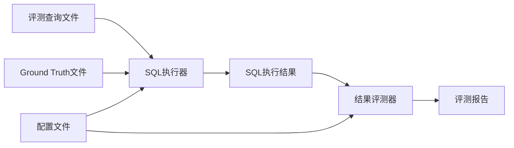

# Text2VectorSQL 评测框架技术文档

## 概述

Text2VectorSQL 评测框架是一个自动化的、端到端的解决方案，专门用于科学地评估 Text-to-Vector SQL 模型的性能。该框架采用**执行与测评分离**的设计，通过统一的配置文件驱动，分两个独立阶段完成整个评测流程。

### 核心特性

- **分离式架构**: 执行和测评完全分离，支持独立运行和调试
- **统一配置**: 通过单一YAML文件控制整个评测流程
- **多指标支持**: 支持基于集合和基于排名的多种评测指标
- **灵活扩展**: 模块化设计，易于添加新指标和功能
- **详细报告**: 生成包含汇总和详细信息的综合JSON报告
- **中间结果可复用**: SQL执行结果可被多次评测

## 系统架构

### 核心组件

```
Evaluation_Framework/
├── run_eval_pipeline.py        # 主控制器 - 统一入口
├── sql_executor.py             # 阶段1: SQL执行器（集成服务管理）
├── evaluate_results.py         # 阶段2: 结果评测器
├── evaluation_config.yaml      # 统一配置文件
├── metrics.py                  # 指标计算模块
├── eval_queries.json           # 评测查询文件
├── ground_truth.json           # Ground Truth 查询文件
├── sql_execution_results.json  # 中间结果文件（自动生成）
├── evaluation_report.json      # 最终评测报告（自动生成）
└── DOCUMENTATION.md            # 技术文档
```

### 两阶段执行流程



### 依赖模块

- **Execution_Engine/**: 负责SQL查询的执行和翻译
- **Embedding_Service/**: 提供文本向量化服务

## 使用指南

### 快速开始

#### 方法1: 运行完整流程（推荐）
```bash
cd Evaluation_Framework
python run_eval_pipeline.py --all
```
**注意**: 默认情况下会自动启动 Embedding Service，无需手动管理。

#### 方法2: 分阶段运行
```bash
# 阶段1: 执行SQL查询（自动启动服务）
python run_eval_pipeline.py --execute

# 阶段2: 计算评测指标
python run_eval_pipeline.py --evaluate
```

#### 方法3: 直接使用单独脚本
```bash
# 仅执行SQL（自动启动服务）
python sql_executor.py

# 仅评测结果
python evaluate_results.py
```

#### 禁用自动服务管理
如果您希望手动管理 Embedding Service，可以使用：
```bash
# 禁用自动服务管理
python run_eval_pipeline.py --all --no-service-management
```

### 1. 配置评测任务

编辑 `evaluation_config.yaml` 文件：

```yaml
# --- SQL执行配置 ---
engine_config_path: ../Execution_Engine/engine_config.yaml
db_type: 'sqlite'
eval_queries_file: eval_queries.json
ground_truth_file: ground_truth.json
execution_results_file: sql_execution_results.json

# --- 嵌入服务配置 ---
# 所有 Embedding Service 的参数都在此处配置
embedding_service:
  auto_manage: true    # 默认启用自动管理
  
  # 服务器配置
  host: "127.0.0.1"
  port: 8000
  
  # 模型配置 - 可以配置多个模型
  models:
    - name: "all-MiniLM-L6-v2"
      hf_model_path: "sentence-transformers/all-MiniLM-L6-v2"
      trust_remote_code: true
      tensor_parallel_size: 1
      max_model_len: 256
    
    # 可以添加更多模型
    # - name: "gte-large"
    #   hf_model_path: "thenlper/gte-large"
    #   trust_remote_code: true
    #   tensor_parallel_size: 1
    #   max_model_len: 512

# --- 评测指标配置 ---
metrics:
  - name: 'f1_score'
  - name: 'precision'
  - name: 'recall'
  - name: 'exact_match'
  - name: 'map'
  - name: 'mrr'
  - name: 'ndcg'
    k: 10

# --- 输出配置 ---
evaluation_report_file: evaluation_report.json
```


#### 评测查询文件 (eval_queries.json)
```json
[
  {
    "query_id": "q1",
    "db_name": "arxiv",
    "sql": "SELECT title FROM papers WHERE author = 'John Doe'"
  }
]
```

#### Ground Truth 文件 (ground_truth.json)
```json
{
  "q1": {
    "db_name": "arxiv",
    "sqls": [
      "SELECT title FROM papers WHERE author_name = 'John Doe'",
      "SELECT paper_title FROM papers WHERE main_author = 'John Doe'"
    ]
  }
}
```

## 代码执行流程详解

### 阶段1: SQL执行 (sql_executor.py)

#### 执行步骤
1. **配置加载**: 读取YAML配置和输入文件
2. **引擎初始化**: 初始化ExecutionEngine
3. **查询执行**: 
   - 遍历每个测试用例
   - 执行测试SQL查询
   - 执行对应的Ground Truth查询
4. **结果保存**: 将所有执行结果保存到中间文件

#### 输出格式 (sql_execution_results.json)
```json
[
  {
    "test_case": {
      "query_id": "q1",
      "db_name": "arxiv", 
      "sql": "SELECT ..."
    },
    "test_execution": {
      "status": "success",
      "columns": ["title"],
      "data": [["Paper 1"], ["Paper 2"]],
      "row_count": 2
    },
    "ground_truth_executions": [
      {
        "sql": "SELECT title FROM papers WHERE author_name = 'John'",
        "execution": {
          "status": "success",
          "columns": ["title"],
          "data": [["Paper 1"], ["Paper 3"]],
          "row_count": 2
        }
      }
    ]
  }
]
```

### 阶段2: 结果评测 (evaluate_results.py)

#### 执行步骤
1. **配置和结果加载**: 读取配置文件和SQL执行结果
2. **数据提取**: 从执行结果中提取成功的数据
3. **黄金标准集构建**:
   - 并集黄金标准集（用于大部分指标）
   - 分级黄金标准集（用于NDCG）
4. **指标计算**: 根据配置计算各种评测指标
5. **结果聚合**: 计算所有测试用例的平均分数
6. **报告生成**: 生成详细的评测报告

## 指标计算详解

### 列对齐和去重策略

评测框架采用智能的列对齐策略来处理待测评SQL和Ground Truth之间的列差异，确保评估的准确性和公平性。

#### 列匹配策略
**问题**: 待测评SQL可能返回比Ground Truth更多的列（冗余列），如何公平比较？

**解决方案**: 基于列名的智能匹配
1. **列名提取**: 从SQL执行结果中获取列名信息
2. **列匹配**: 找到待测评结果中与Ground Truth列名相同的列
3. **列提取**: 只提取匹配的列，按Ground Truth的列顺序重新排列
4. **去重处理**: 对提取后的结果行进行去重，保持原始顺序
5. **回退机制**: 如果没有列名信息，自动回退到位置匹配

#### 工作示例
```python
# Ground Truth结果: 
data = [(1, 'Alice'), (2, 'Bob')]
columns = ['id', 'name']

# 待测评SQL结果:
test_data = [(1, 'Alice', 25, 'Engineer'), (2, 'Bob', 30, 'Manager'), (1, 'Alice', 25, 'Engineer')]
test_columns = ['id', 'name', 'age', 'job']

# 处理步骤:
# 1. 识别匹配列: ['id', 'name'] 
# 2. 提取对应数据: [(1, 'Alice'), (2, 'Bob'), (1, 'Alice')]
# 3. 去重处理: [(1, 'Alice'), (2, 'Bob')]
# 4. 进行评估比较
```

#### 优势
- **准确性**: 避免冗余列影响评估结果
- **公平性**: 只比较语义相关的列
- **鲁棒性**: 自动处理重复数据
- **智能回退**: 兼容没有列名信息的情况

### 基于集合的指标 (不考虑顺序)

这类指标将查询结果视为无序集合，使用**并集黄金标准集**进行评判。

#### 1. 精确率 (Precision)
**衡量内容**: 返回结果的"纯度" - 返回的结果中有多少是正确的

**计算公式**:
```
Precision = |Test_Set ∩ Golden_Set| / |Test_Set|
```

#### 2. 召回率 (Recall)
**衡量内容**: 查询的"完整性" - 所有应该找到的结果中，实际找到了多少

**计算公式**:
```
Recall = |Test_Set ∩ Golden_Set| / |Golden_Set|
```

#### 3. F1分数 (F1-Score)
**衡量内容**: 精确率和召回率的调和平均数，综合评估准确性

**计算公式**:
```
F1 = 2 × (Precision × Recall) / (Precision + Recall)
```

#### 4. 完全准确率 (Exact Match)
**衡量内容**: 测试结果是否与黄金标准完全一致

**计算公式**:
```
Exact_Match = 1 if Test_Set == Golden_Set else 0
```

### 基于排名的指标 (考虑顺序)

这类指标将测试结果视为有序列表，排名越靠前的正确结果价值越高。

#### 1. 平均精度均值 (Mean Average Precision, MAP)
**衡量内容**: 整个排序列表的平均表现，是搜索质量的黄金标准

**计算步骤**:
1. 遍历测试结果的有序列表
2. 每遇到一个正确结果，计算当前位置的精确率
3. 将所有精确率相加，除以相关项总数

**示例**: 
- 测试结果: [A, B, C, D, E]
- 黄金标准: {A, C, E}
- 计算过程:
  - 位置1: A正确, P@1 = 1/1 = 1.0
  - 位置3: C正确, P@3 = 2/3 = 0.67
  - 位置5: E正确, P@5 = 3/5 = 0.6
- AP = (1.0 + 0.67 + 0.6) / 3 = 0.76

#### 2. 平均倒数排名 (Mean Reciprocal Rank, MRR)
**衡量内容**: 多快能找到第一个正确答案

**计算公式**:
```
RR = 1/k (k是第一个正确结果的排名)
MRR = Average(RR_all_queries)
```

**适用场景**: 特别适合问答系统，用户通常只需要一个正确答案。

#### 3. 归一化折扣累计收益 (NDCG@k)
**衡量内容**: 最科学的排序质量评估指标，考虑相关性等级和位置折扣

**核心概念**:
- **相关性分级**: 根据结果在Ground Truth中的出现次数确定相关性等级
- **位置折扣**: 排名越靠后，价值越小
- **归一化**: 与理想排序比较，得出0-1之间的分数

**计算步骤**:

1. **计算DCG@k (Discounted Cumulative Gain)**:
```python
dcg = 0.0
for i, result in enumerate(test_results[:k]):
    relevance = graded_golden_set.get(result, 0)  # 相关性等级
    if relevance > 0:
        dcg += relevance / np.log2(i + 2)  # 位置折扣
```

2. **计算IDCG@k (Ideal DCG)**:
```python
ideal_relevances = sorted(graded_golden_set.values(), reverse=True)
idcg = 0.0
for i, relevance in enumerate(ideal_relevances[:k]):
    idcg += relevance / np.log2(i + 2)
```

3. **归一化**:
```python
ndcg = dcg / idcg if idcg > 0 else 0.0
```

## 多Ground Truth的消偏策略

### 问题背景
当一个查询对应多个Ground Truth时，如何公平地聚合它们的结果是关键问题。

### 解决方案

#### 1. 并集策略 (用于大部分指标)
```python
golden_set_union = set(tuple(row) for row in all_gt_results_data)
```

**优势**:
- 包容性强，承认"正确"有多种形式
- 为召回率提供真实的上限
- 避免因匹配特定GT而受惩罚

#### 2. 多级相关性策略 (用于NDCG)
```python
graded_golden_set = defaultdict(int)
for row in all_gt_results_data:
    graded_golden_set[tuple(row)] += 1
```

**优势**:
- 将出现频次转化为置信度
- 奖励高共识度的结果
- 充分利用多GT的信息

### 策略对比

| 方法 | 适用指标 | 优势 | 应用场景 |
|------|----------|------|----------|
| 并集 | F1, MAP, MRR | 全面性、公平性 | 大部分评测指标 |
| 交集 | 补充指标 | 高置信度 | 共识度分析 |
| 多级相关性 | NDCG | 科学量化置信度 | 排序质量评估 |

## 输出报告结构

### 最终报告格式 (evaluation_report.json)
```json
{
  "evaluation_summary": {
    "total_cases": 100,
    "successful_evaluations": 95,
    "evaluation_success_rate": 0.95,
    "average_f1_score": 0.85,
    "average_map": 0.78,
    "average_ndcg@10": 0.82,
    "count_f1_score": 95
  },
  "individual_results": [
    {
      "test_case": {
        "query_id": "q1",
        "db_name": "arxiv",
        "sql": "SELECT ..."
      },
      "execution_summary": {
        "test_status": "success",
        "test_row_count": 2,
        "ground_truth_summary": [
          {
            "sql": "SELECT title FROM papers WHERE author_name = 'John'",
            "status": "success",
            "row_count": 2
          }
        ],
        "total_gt_rows": 2
      },
      "scores": {
        "f1_score": 0.67,
        "precision": 0.5,
        "recall": 1.0,
        "map": 0.75,
        "ndcg@10": 0.8
      }
    }
  ]
}
```

### 报告解读

#### Evaluation Summary部分
- **total_cases**: 总测试用例数
- **successful_evaluations**: 成功评测的用例数  
- **evaluation_success_rate**: 评测成功率
- **average_***: 各指标的平均分数
- **count_***: 参与计算的用例数量

#### Individual Results部分
- **test_case**: 原始测试用例信息
- **execution_summary**: 执行状态摘要
- **scores**: 该用例的各项指标得分

## 高级功能

### 1. 分离式运行的优势

#### 独立调试
```bash
# 只重新运行评测部分，无需重复执行SQL
python run_eval_pipeline.py --evaluate
```

#### 多次评测
```bash
# 修改指标配置后，基于同一组执行结果重新评测
python evaluate_results.py --config new_metrics_config.yaml
```

#### 并行处理
```bash
# 可以在不同机器上分别运行执行和评测
# 机器A: 执行SQL查询
python sql_executor.py

# 机器B: 评测结果
python evaluate_results.py --execution-results results_from_machine_a.json
```

### 2. 错误处理与容错

#### 执行阶段错误处理
- SQL执行失败的用例会被标记但不影响其他用例
- 提供详细的错误信息用于调试
- 支持部分成功的批量处理

#### 评测阶段错误处理  
- 跳过执行失败的用例
- 提供执行状态摘要
- 计算有效用例的统计信息

### 3. 可扩展性

#### 添加新指标
1. 在 `metrics.py` 中实现计算函数
2. 在 `evaluate_results.py` 中添加调用逻辑
3. 在配置文件中启用新指标

#### 自定义聚合策略
可以通过修改Golden Set构建逻辑来实现不同的消偏策略：
- 加权并集
- 投票机制  
- 置信度阈值过滤

## 最佳实践

### 1. 指标选择建议
- **核心指标**: F1-Score (必选)
- **排序质量**: NDCG@10 (向量查询推荐)
- **快速响应**: MRR (问答系统推荐)
- **补充参考**: MAP, Exact Match

### 2. 配置建议
```yaml
metrics:
  - name: 'f1_score'      # 核心指标
  - name: 'precision'     # 分析用
  - name: 'recall'        # 分析用
  - name: 'ndcg'          # 排序质量
    k: 10                 # 根据应用场景调整
  - name: 'mrr'           # 首个正确答案
```

### 3. 数据准备建议
- 确保Ground Truth的多样性和代表性
- 测试用例应涵盖不同难度和类型
- Ground Truth数量建议2-5个，平衡质量和效率

### 4. 工作流程建议

#### 开发阶段
```bash
# 快速测试：小批量数据验证流程
python run_eval_pipeline.py --all --config test_config.yaml

# 调试SQL执行问题
python run_eval_pipeline.py --execute
# 检查 sql_execution_results.json

# 调试指标计算问题  
python run_eval_pipeline.py --evaluate
```

#### 生产阶段
```bash
# 大批量评测：分阶段运行提高稳定性
python run_eval_pipeline.py --execute
# 检查执行结果无误后再评测
python run_eval_pipeline.py --evaluate
```

### 5. 性能优化建议

#### 执行优化
- 合理设置数据库连接超时
- 对大量查询进行批次处理
- 监控SQL执行性能

#### 评测优化
- 对于大数据集，考虑采样评测
- 缓存中间计算结果
- 并行计算不同指标

## 故障排除

### 常见问题

#### 1. SQL执行失败
- 检查数据库连接配置
- 验证SQL语法正确性
- 确认数据库中存在相关表和数据

#### 2. 指标计算异常
- 检查Ground Truth文件格式
- 验证测试用例与GT的query_id匹配
- 确认执行结果数据格式正确

#### 3. 配置文件错误
- 验证YAML语法正确性
- 检查文件路径是否存在
- 确认指标配置格式正确

### 调试技巧

#### 查看中间结果
```bash
# 检查SQL执行结果
cat sql_execution_results.json | python -m json.tool

# 检查特定用例的执行情况
jq '.[] | select(.test_case.query_id == "q1")' sql_execution_results.json
```

#### 逐步调试
```bash
# 单独运行各阶段
python sql_executor.py --config debug_config.yaml
python evaluate_results.py --config debug_config.yaml
```

---

*本文档涵盖了Text2VectorSQL评测框架的完整技术细节。如需了解更多实现细节，请参考源代码注释和相关学术文献。*