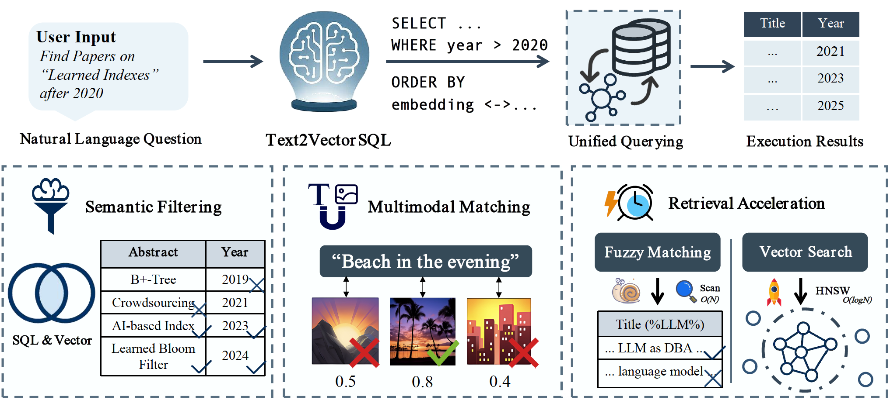
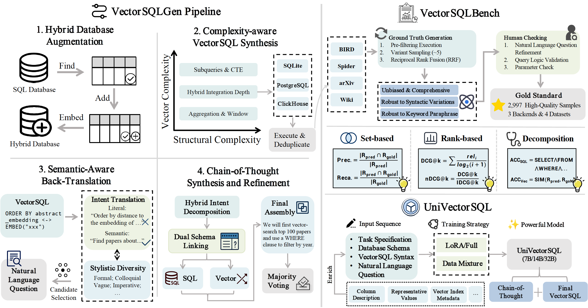

<!--   -->
<h1 align="center"> Text2VectorSQL: Towards a Unified Interface for <br>Vector Search and SQL Queries </h1>

<p align="center">
<a href='https://arxiv.org/abs/2506.23071'></a>  
<a href='https://huggingface.co/VectorSQL'></a>
<a href="https://opensource.org/license/apache-2-0" target="_blank"></a>
<a href="https://github.com/OpenDCAI/Text2VectorSQL" target="_blank"></a>
</p>

<h5 align="center"> If you like our project, please give us a star ⭐ on GitHub for the latest update.</h5>

## 💡 Overview

This project proposes **Text2VectorSQL**, a new task aimed at building a unified natural language interface for querying both **structured data** and **unstructured data**.

<table class="center">
    <tr>
        <td width=100% style="border: none"></td>
    </tr>
    <tr>
        <td width="100%" style="border: none; text-align: center; word-wrap: break-word">
          Illustration of the Text2VectorSQL task, with scenarios below showing how integrating SQL queries with vector search unlocks semantic filtering, multi-modal matching and retrieval acceleration. These capabilities are indispensable for universal natural language interfaces.
      </td>
    </tr>
</table>

Traditional Text2SQL systems have made significant progress in accessing structured data like tables, but they cannot understand semantic or multi-modal queries. Meanwhile, vector search has become the standard for querying unstructured data (such as text, images), but integrating it with SQL (known as VectorSQL) still relies on manual, error-prone query construction and lacks standardized evaluation methods.

Text2VectorSQL aims to bridge this fundamental gap by providing a comprehensive foundational ecosystem:

<table class="center">
    <tr>
        <td width=100% style="border: none"></td>
    </tr>
    <tr>
        <td width="100%" style="border: none; text-align: center; word-wrap: break-word">
        The Text2VectorSQL Ecosystem. The core component is VectorSQLGen pipeline, a large-scale, automated data synthesis engine that produces high-quality training samples. Then, the synthesized data is used to train our family of UniVectorSQL models. Concurrently, a curated subset of data undergoes a more rigorous, human-review process to create VectorSQLBench, our gold-standard evaluation benchmark with a suite of novel and fine-grained metrics.
      </td>
    </tr>
</table>

-----

## 🚀 Project Architecture & Core Modules

This repository contains a complete ecosystem, divided into four core modules:

1.  **Data Synthesis (Data\_Synthesizer)**:
    A scalable pipeline for automatically synthesizing "quadruplet" training data (database, natural language question, VectorSQL query, chain-of-thought) starting from public base tables.
2.  **Execution Engine (Execution\_Engine)**:
    A backend engine responsible for parsing and executing VectorSQL queries. It handles the special `lembed(model, text)` function by calling an **Embedding Service** and translates it into a native query compatible with the target database (SQLite, PostgreSQL, ClickHouse).
3.  **Embedding Service (Embedding\_Service)**:
    A high-performance API service based on FastAPI that provides on-demand text and image vectorization capabilities for the **Execution Engine**. It supports multiple models, multiple GPUs, and can automatically cache models.
4.  **Evaluation Framework (Evaluation\_Framework)**:
    A framework for comprehensively evaluating the performance of Text2VectorSQL models. It provides an accurate assessment by **executing** the model-generated SQL and the gold SQL, then comparing their **execution results** (rather than the SQL strings).

-----

## 🔧 Installation

1.  Clone this repository:

    ```bash
    git clone https://github.com/OpenDCAI/Text2VectorSQL.git --depth 1
    cd Text2VectorSQL
    ```

2.  Depending on the module you need to use, install its separate dependencies. Each module (`Data_Synthesizer`, `Execution_Engine`, `Embedding_Service`, `Evaluation_Framework`) has a `requirements.txt` file in its directory.

    For example, to install the dependencies for the Execution Engine:

    ```bash
    cd Execution_Engine
    pip install -r requirements.txt
    ```

-----

## ⚡ Quick Start

You can use the project's toolchain according to the following scenarios based on your goals:

### Scenario 1: Run the Embedding Service (Prerequisite for all execution)

`Execution_Engine` depends on this service to fetch vectors.

1.  **Configure the service**:
    Go to the `Embedding_Service/` directory, create a `config.yaml` file, and specify the models you want to use.
    ```yaml
    # Example config.yaml
    server:
      host: "0.0.0.0"
      port: 8000
    
    models:
      - name: "all-MiniLM-L6-v2"
        hf_model_path: "sentence-transformers/all-MiniLM-L6-v2"
        local_model_path: "./models/all-MiniLM-L6-v2"
        trust_remote_code: true
      # ... other models
    ```
2.  **Start the service**:
    ```bash
    cd Embedding_Service/
    bash run.sh
    ```
    The service will run on `http://0.0.0.0:8000`. Models will be downloaded automatically on the first run.

### Scenario 2: Execute a VectorSQL Query

Ensure the **Embedding Service** from Scenario 1 is running.

`Execution_Engine` can be used as a command-line tool:

1.  **Configure the engine**:
    Go to the `Execution_Engine/` directory, create `engine_config.yaml`, and specify the Embedding Service address and database connection information.
    ```yaml
    embedding_service:
      url: "http://127.0.0.1:8000/embed" # Corresponds to the service in Scenario 1
    
    database_connections:
      clickhouse:
        host: "localhost"
        port: 8123
        # ...
    
    timeouts:
      sql_execution: 60
    ```
2.  **Run the query**:
    ```bash
    cd Execution_Engine/
    python execution_engine.py \
        --sql "SELECT Name FROM musical m ORDER BY L2Distance(Category_embedding, lembed('all-MiniLM-L6-v2','opera')) LIMIT 5;" \
        --db-type "clickhouse" \
        --db-identifier "musical" \
        --config "engine_config.yaml"
    ```

### Scenario 3: Synthesize a New Text2VectorSQL Dataset

Use the `Data_Synthesizer` module.

1.  **Configure the pipeline**:
    Go to the `Data_Synthesizer/` directory, copy `pipeline/config.yaml.example` to `config.yaml`.
    Fill in your LLM API-Key, Base-URL, etc., in `config.yaml`.
2.  **Select a dataset**:
    Edit `pipeline/general_pipeline.py` and modify the `DATASET_BACKEND` and `DATASET_TO_LOAD` variables at the top.
3.  **Run the pipeline**:
    ```bash
    cd Data_Synthesizer/
    python pipeline/general_pipeline.py
    ```
    The final synthesized dataset will be saved in the `result_path` configured in `config.yaml`.

### Scenario 4: Evaluate a Text2VectorSQL Model

Use the `Evaluation_Framework` module.

1.  **Prepare data**: Ensure you have an evaluation file (`eval_data_file`) containing the model's predicted SQL. If not, run `generate.py` to create it.

2.  **Configure evaluation**:
    Go to the `Evaluation_Framework/` directory and create `evaluation_config.yaml`.
    Configure the database type (`db_type`), database file root directory (`base_dir`), input file (`eval_data_file`), and evaluation metrics (`metrics`).

3.  **Run the evaluation pipeline**:

    ```bash
    cd Evaluation_Framework/
    
    # Run the full pipeline (SQL execution + result evaluation)
    python run_eval_pipeline.py --all --config evaluation_config.yaml
    
    # Or run in steps
    # python run_eval_pipeline.py --execute --config evaluation_config.yaml
    # python run_eval_pipeline.py --evaluate --config evaluation_config.yaml
    ```

    The evaluation report (JSON file) will be saved in the configured output path. You can use `aggregate_results.py` to aggregate multiple reports into a CSV.

-----

## 🧩 Module Details

### 1\. Data Synthesis (Data\_Synthesizer)

This module is the foundation for training powerful Text2VectorSQL models (like UniVectorSQL). It generates high-quality Text2VectorSQL datasets through an automated pipeline.

**Core Pipeline**:

1.  **Database Synthesis & Enhancement (`database_synthesis`)**: Generates structured databases based on Web tables.
2.  **Database Vectorization (`vectorization`)**: Identifies "semantically-rich" columns (e.g., descriptions), uses Sentence Transformers to generate vector embeddings, and builds new databases that support vector queries.
3.  **VectorSQL & Question Synthesis (`synthesis_sql`, `synthesis_nl`)**: Automatically generates VectorSQL queries of varying complexity and reverse-translates them to generate corresponding natural language questions.
4.  **Chain-of-Thought Synthesis (`synthesis_cot`)**: Generates detailed reasoning steps (Chain-of-Thought) for each data sample, explaining the derivation process from the question to the VectorSQL.

You can run the complete end-to-end synthesis process with a single command using the `pipeline/general_pipeline.py` script.

### 2\. Execution Engine (Execution\_Engine)

This is the runtime core of Text2VectorSQL. It acts as a bridge, parsing VectorSQL queries that contain semantic search intent and translating them into native queries that the database can understand.

**Core Features**:

  * **Parses `lembed` Function**: The engine is specifically designed to process queries with the `lembed(model, text)` syntax.
  * **Dynamic Vectorization**:
    1.  The engine parses the query and extracts all unique `(model, text)` combinations.
    2.  It sends a network request to an external **Embedding Service** to get the vector representations for this text.
  * **SQL Translation & Execution**:
    1.  After receiving the vectors, the engine replaces the `lembed(...)` call with the database's native vector literal (e.g., `[0.1, 0.2, ...]` in PostgreSQL).
    2.  It connects to the target database (supports PostgreSQL, ClickHouse, SQLite) and executes the translated native query.
  * **Robustness**: The engine implements robust timeout and error management for network requests and database execution.

### 3\. Embedding Service (Embedding\_Service)

This is a standalone, high-performance API service that acts as the vectorization backend for the `Execution_Engine`.

**Key Features**:

  * **High-Performance**: Based on FastAPI and Uvicorn, providing asynchronous processing capabilities.
  * **Multi-Model & Multi-GPU**: Supports loading and managing multiple models simultaneously via `config.yaml` (e.g., `all-MiniLM-L6-v2` or `CLIP`), with support for tensor parallelism.
  * **Automatic Caching**: Automatically downloads models from Hugging Face Hub on startup and caches them locally, avoiding repeated downloads.
  * **Core API Endpoints**:
      * `/embed`: Receives a model name and a list of text/images, returns vectors.
      * `/health`: Health check.

### 4\. Evaluation Framework (Evaluation\_Framework)

To objectively evaluate the true capabilities of Text2VectorSQL models, we built a dedicated evaluation framework. The framework compares the **execution results** of the predicted SQL and the gold SQL, rather than just the SQL strings. This is crucial for vector search, as approximate results are acceptable, and SQL queries with different syntax can produce the same result.

**Evaluation Pipeline**:

1.  **SQL Generation (`generate.py`)**: Calls the model (via vLLM or API) to generate predicted SQL queries for the evaluation questions.
2.  **SQL Execution (`sql_executor.py`)**: Executes the predicted SQL and all gold SQL queries separately in sandboxed processes (with timeouts) and caches both execution results.
3.  **Result Evaluation (`evaluate_results.py`)**: Compares the predicted results with the gold results and calculates a series of evaluation metrics.
      * **Set-based Metrics**: Precision, Recall, F1-Score.
      * **Rank-based Metrics**: nDCG@k, MAP, MRR.
      * **Decomposed Metrics**: $ACC_{SQL}$ (SQL skeleton correctness) and $ACC_{Vec}$ (Vector component correctness).
4.  **Result Aggregation (`aggregate_results.py`)**: Aggregates the JSON reports from multiple experiments into an easy-to-compare CSV file.

## 📖 Citation

If you find this work helpful, please cite our paper:

```bibtex
@article{wang2025text2vectorsql,
  title={Text2VectorSQL: Towards a Unified Interface for Vector Search and SQL Queries},
  author={Wang, Zhengren and Yao, Dongwen and Li, Bozhou and Ma, Dongsheng and Li, Bo and Li, Zhiyu and Xiong, Feiyu and Cui, Bin and Tang, Linpeng and Zhang, Wentao},
  journal={arXiv preprint arXiv:2506.23071},
  year={2025}
}
```

## ❤️ Acknowledgements

This repo benefits from: [LLaMA-Factory](https://github.com/hiyouga/LLaMA-Factory), [vLLM](https://github.com/vllm-project/vllm), [ChatData](https://github.com/myscale/ChatData), [PostgreSQL](https://github.com/postgres/postgres)，[ClickHouse](https://github.com/ClickHouse/ClickHouse), [pgvector](https://github.com/pgvector/pgvector), [sqlite-vec](https://github.com/asg017/sqlite-vec). 

Thanks for wonderful works.

## 📞 Contact Us

For any questions or feedback, please reach out to us at [wzr@stu.pku.edu.cn](wzr@stu.pku.edu.cn).